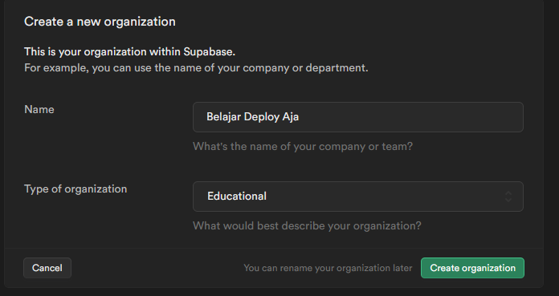
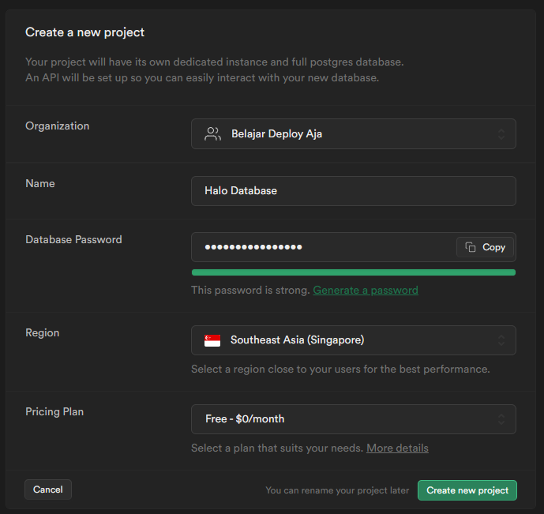
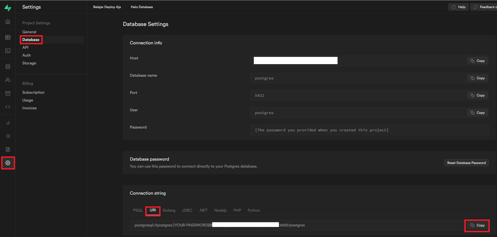
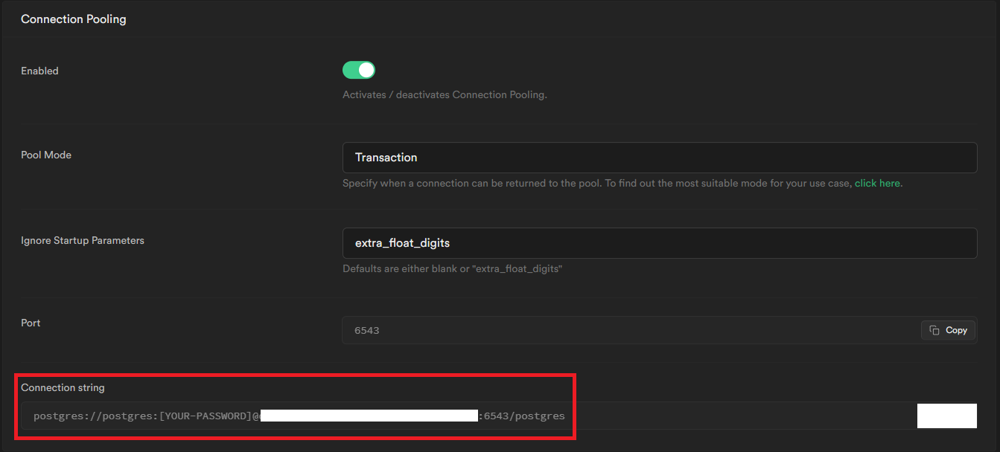
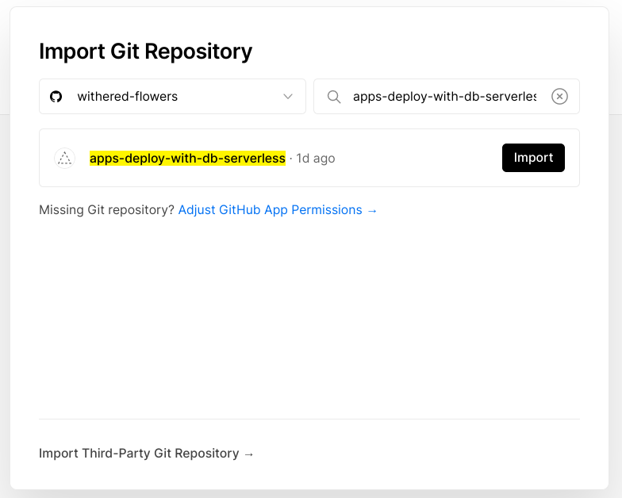
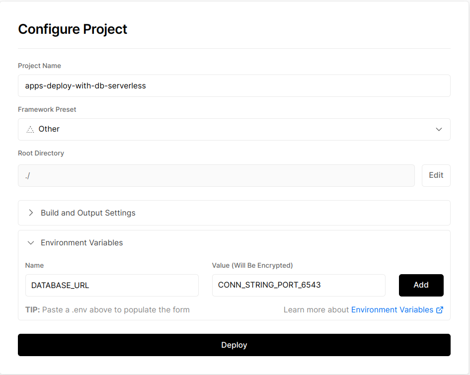

# Education Deploy Apps With DB (Serverless)

## Table of Contents

- [Persyaratan Dasar](#persyaratan-dasar)
- [Disclaimer](#disclaimer)
- [Perkenalan](#perkenalan)
- [Let's Demo](#lets-demo)
  - [Langkah 1 - Inisialisasi Project](#langkah-1---inisialisasi-project)
  - [Langkah 2 - Setup Database (Supabase)](#langkah-2---setup-database-supabase)
  - [Langkah 3 - Migration & Seeding Database Production](#langkah-3---migration--seeding-database-production)
  - [Langkah 4 - Langkah 4 - Deploy to Vercel (Percobaan Pertama)](#langkah-4---deploy-to-vercel-percobaan-pertama)

## Persyaratan Dasar

- Mengerti perintah dasar pada Linux
- Menginstall nodejs dan postgresql
- Memiliki akun github
- Mengerti penggunaan command line `git`
- Memiliki akun Vercel yang sudah ter-link dengan github
- Menggunakan Aplikasi berbasis Express (dan Sequelize)
- [OPTIONAL] sudah membaca pembelajaran yang sebelumnya tentang deployment di Vercel di https://education.withered-flowers.dev/education-deploy-apps-serverless

## Disclaimer

Pada pembelajaran ini disediakan sebuah kode sederhana yang sudah siap dan bisa digunakan.

Aplikasi ini menggunakan:

- `ExpressJS` sebagai Backend Framework
- `Sequelize` sebagai Object Relational Mapper-nya (ORM)
- `PostgreSQL` sebagai Database

(Dalam pembelajaran ini asumsinya adalah aplikasi sudah ready dan siap dideploy, sehingga tidak ada contoh untuk develop secara lokal lagi yah.)

Aplikasi ini nanti akan di-deploy pada `Vercel` dan untuk Database akan menggunakan `Supabase`.

Apabila belum memiliki akun `Supabase`, Sangat disarankan untuk `Login with Github` dalam pembelajaran ini agar cepat terkoneksi dengan `Supabase`.

## Perkenalan

Pada pembelajaran sebelumnya (https://github.com/withered-flowers/education-deploy-apps-serverless), kita sudah belajar bagaimana cara mendeploy aplikasi berbasis Express secara Serverless (Function) dengan menggunakan Vercel.

Tapi, aplikasi sebelumnya kita masih belum menggunakan database secara lansgung yah (hanya menarik data langsung dari pihak ketiga saja).

Nah pada pembelajaran ini kita akan mencoba untuk mendeploy aplikasi berbasis Express yang menggunakan Sequelize dan PostgreSQL sebagai databasenya yah ke Vercel, sebagai Serverless Function (lagi) yah.

Jadi tanpa ba bi bu lagi, yuk kita masuk ke demo !

## Let's Demo

Dalam demo ini, secara garis besarnya yang akan kita lakukan adalah sebagai berikut:

- Melakukan migrasi database dari komputer lokal ke Supabase
- Melakukan perubahan kode
- Deploy aplikasi ke Vercel

Disclaimer:

- Untuk deploy serverless function dengan database **UNTUK SETIAP PROVIDER AKAN MEMILIKI CARANYA TERSENDIRI** dan **TRICKNYA SENDIRI**
- Cara yang digunakan di sini adalah cara untuk mendeploy pada `Vercel` dan databasenya ada di `Supabase`, bila menggunakan yang lain akan ada penyesuaian tersendiri yah !

## Langkah 1 - Inisialisasi Project

1. Karena pada akhirnya kita akan deploy aplikasi pada Vercel, maka kita akan membutuhkan sebuah repository git (Github / Gitlab / Bitbucket) terlebih dahulu. Pada pembelajaran ini kita menggunakan Github yah.

1. Membuat sebuah repository kosong yang baru baru pada Github dengan nama apapun.

   asumsi:

   - Nama user github: `nama-user-sendiri`
   - Nama repo: `nama-repo-sendiri`
   - Protocol: `https` (untuk SSH disesuaikan sendiri yah)

1. Memasukkan perintah berikut pada terminal yang digunakan

   ```bash
   # Clone Repo

   git clone https://github.com/withered-flowers/education-deploy-apps-with-db-serverless

   # Masuk ke Folder Clone

   cd education-deploy-apps-with-db-serverless

   # Masuk ke folder kode

   cd sources/a-start

   # Inisialisasi Git

   git init

   # Melakukan add dan commit untuk Repo

   git branch -M main
   git add .
   git commit -m "feat: initial commit"

   # Menambahkan origin ke github

   git remote add origin \
      https://github.com/nama-user-sendiri/nama-repo-sendiri.git

   # Push ke github

   git push -u origin main
   ```

1. Sampai pada titik ini, seharusnya pada repo `nama-repo-sendiri` yang ada di akun Github, sudah ada code yang berisi app.js dan lain lainnya ini.

Langkah selanjutnya adalah kita akan menyiapkan Database yang diperlukan terlebih dahulu, sebelum kita akan melakukan deployment.

## Langkah 2 - Setup Database (Supabase)

Pada langkah ini kita akan membuat database terlebih dahulu pada `Supabase`. `Supabase` (https://supabase.com/), merupakan suatu produk BaaS (Backend as a Service), yang dibuat dengan teknologi Open Source, dimana untuk databasenya, yang digunakan adalah `PostgreSQL`. `Supabase` ini dibuat untuk menyaingi beberapa Cloud Provider (sebut saja `Firebase`) agar tidak terlalu `vendor lock-in` (sangat ketergantungan dengan teknologi yang vendor berikan).

Untuk pricingnya sendiri pun `Supabase` ini cukup bersahabat, hanya saja limitasi terbesarnya adalah: **satu akun free hanya bisa memiliki 2 project saja** (dalam artian, hanya bisa ada 2 project dengan database yang berbeda).

TL;DR: `Supabase` itu gratis (dalam batasan tertentu), jadi kita menggunakannya.

Langkah untuk menggunakan Setup Project `Supabase` adalah sebagai berikut:

1. Buka browser kemudian buka web https://supabase.com
1. Sign In dengan menggunakan Github (`Start your project` -> `Sign Up now` -> `Continue with GitHub`)
1. Ketika selesai melakukan Sign Up dan berhasil Sign In, maka kita akan diberikan pertanyaan untuk membuat Organization di dalam Project Supabase:

   - **Name**: `namanya-terserah-yang-buat`
   - **Type of Organization**: `Education`

   Kemudian pilih `Create Organization`

   Contohnya adalah sebagai berikut:

   

1. Kemudian setelah ini, kita akan diminta untuk menuliskan nama Project yang akan kita buat. Project ini akan berisi sebuah database untuk PostgreSQL yang kita gunakan. **JANGAN LUPA YAH UNTUK PASSWORDNYA**:

   - **Name**: `namanya-terserah-lagi`
   - **Database Password**: `yang-aman-dan-jangan-sampai-lupa`
   - **Region**: `Southeast Asia (Singapore)`
   - **Pricing Plan**: `Free - $0/month` (tentu saja yang ini)

   Kemudian pilih `Create Project`

   Contohnya adalah sebagai berikut:

   

1. Tunggu sampai `Supabasenya` selesai membuat databasenya.

1. Ketika sudah selesai membuat databasenya, `Supabase` akan memindahkan kita ke halaman Dashboard. Pada halaman Dashboard ini, kita akan pilih sidebar `Settings`, kemudian akan dibawa pada halaman `Project Settings`, kemudian pilih `Database`, dan kita akan diberikan informasi tentang `Database Settings`.

   Pada tab `Connection String`, kita akan pilih versi `URI` dan `Copy` Connection Stringnya dan paste ke tempat yang aman.

   

   (Jangan lupa untuk ganti **[YOUR-PASSWORD]** dengan password database yang dibuat di atas yah)

1. Perhatikan juga pada Card `Connection Pooling`, terdapat 1 Connection String lagi yah, ini juga harus kita catat dan `Copy` Connection Stringnya dan paste ke tempat yang aman.

   

   (Jangan lupa untuk ganti **[YOUR-PASSWORD]** dengan password database yang dibuat di atas yah)

1. **Mengapa ada 2 Connection String?**

   - Connection String pertama (port `5432`), adalah Connection String untuk kita berkoneksi dengan database secara langsung, seperti kita menggunakan database client (semacam DBeaver, psql, adminer, phpmyadmin dsb)
   - Connection String kedua (port `6543`), adalah Connection String untuk kita gunakan dalam aplikasi yang umumnya menggunakan `Serverless Function`, karena kita akan menembak databasenya terus terusan per request, sehingga kalau kita menggunakan direct connection tidak terlalu baik untuk performa.

Sampai pada titik ini, kita sudah berhasil membuat database yang akan digunakan untuk deployment kita nanti. Perhatikan bahwa pada `Supabase`, database-nya sudah dibuat yah. Sehingga untuk pengguna **sequelize** dan ORM lainnya, **JANGAN CREATE DATABASE-nya** lagi, melainkan langsung `migration` dan `seed` saja nantinya.

Selanjutnya kita akan mencoba bertindak sebagai "non-developer" dengan melakukan migrasi dan seeding data awal pada database.

## Langkah 3 - Migration & Seeding Database Production

**Langkah ini umumnya tidak dilakukan oleh developer pada level production**, melainkan oleh database administrator apabila di perusahaan besar. (Tapi bisa juga dilakukan oleh developer bila di kantor menganut sistem palugada - _apa lu mau gw (gak) ada_ !)

Pada langkah ini kita akan melakukan pembuatan tabel pada Production database dan melakukan penambahan data awal (seeding). Untuk pembelajaran ini seeding dilakukan dengan mengenerate random data untuk dimasukkan ke dalam database yah.

Langkahnya adalah sebagai berikut:

1. Buka terminal pada PC Lokal kita sendiri
1. Set Environment Variabel untuk database (umumnya bernama `DATABASE_URL`) dengan valuenya adalah `Connection String - Direct Connection (ConnStringDC)` (yang port `5432`) pada komputer lokal kita dengan perintah sebagai berikut:

   - [Windows - CMD] - `setx DATABASE_URL "ConnStringDC"`
   - [Windows - PowerShell] - `$Env:DATABASE_URL = "ConnStringDC"`
   - [Linux & MacOS] - `export DATABASE_URL='ConnStringDC'`

   Dimana `ConnStringDC` adalah Connection String pertama yang kita copy pada ;langkah sebelumnya.

   **DISCLAIMER**:

   Setting Environment Variable seperti ini hanya bersifat _ephemeral_, dalam artian ketika terminal ditutup dan dibuka lagi, maka Key dan Valuenya nya akan hilang.

1. Selanjutnya karena pada aplikasi Express ini kita menggunakan sequelize sebagai ORMnya dan sequelize-cli sebagai tools tambahannya, kita bisa menggunakan Database Creation, Migration, dan Seeding via sequelize-cli:

   - https://github.com/sequelize/cli

1. Buka kembali folder `sources/a-start` kemudian lakukan install package node dengan langkah berikut:

   - [npm] `npm install`
   - [yarn] `yarn add`
   - [pnpm] `pnpm install`

1. Buka dan modifikasi file `config/config.json` untuk bisa menggunakan environment variable dengan nama `DATABASE_URL` pada production. perubahan kodenya adalah sebagai berikut:

   ```json
   {
     "development": {
       "username": "root",
       "password": null,
       "database": "database_development",
       "host": "127.0.0.1",
       "dialect": "mysql"
     },
     "test": {
       "username": "root",
       "password": null,
       "database": "database_test",
       "host": "127.0.0.1",
       "dialect": "mysql"
     },
     // Yang kita ganti adalah yang dari sini
     "production": {
       "use_env_variable": "DATABASE_URL",
       "ssl": true,
       "dialect": "postgres",
       "protocol": "postgres",
       "dialectOptions": {
         "ssl": {
           "require": true,
           "rejectUnauthorized": false
         }
       }
     }
   }
   ```

1. Jalankan perintah berikut pada terminal:

   ```bash
   # (npm / yarn)
   npx sequelize-cli db:migrate --env=production
   npx sequelize-cli db:seed:all --env=production

   # (pnpm)
   pnpm sequelize-cli db:migrate --env=production
   pnpm sequelize-cli db:seed:all --env=production
   ```

1. Maka setelah langkah ini selesai dan semuanya berjalan baik baik saja, seharusnya pada Supabase, ketika kita melihat pada `Table Editor`, maka kita akan mendapatkan data kita yang sudah siap di level Production !

Selanjutnya kita akan mencoba untuk deploy aplikasi kita ini ke `Vercel`.

## Langkah 4 - Deploy to Vercel (Percobaan Pertama)

Pada langkah ini kita akan mencoba untuk mendeploy aplikasi yang sudah dibuat ke Vercel dan melihat apakah aplikasi bisa berjalan dengan baik atau tidak.

Langkahnya adalah sebagai berikut:

1. Buka web vercel (`https://vercel.com`) dan lakukan login
1. Pada Dashboard Vercel, pilih `Add New...` -> `Project` dan kita akan diminta untuk meng-import repository Git.
1. Pilih repo yang sudah dibuat pada saat inisialisasi project, dan tekan tombol `Import`.

   

1. Kemudian kita akan dipindahkan ke halaman `Dashboard` untuk melakukan konfigurasi. Pada tab `Configure Project`, expand Accordion dengan nama `Environment Variables`, dan masukkan key-nya (`Name`) adalah `DATABASE_URL` dan `Value` nya adalah `Connection String yang Kedua` (port 6543), kemudian tekan tombol `Deploy`.

   

1. Kemudian kita akan menunggu hingga deploymentnya selesai dan diberikan halaman outputnya oleh Vercel.

   Dan ternyata... Gagal 😭

   Hal ini terjadi karena kita belum membuat aplikasi kita ini menjadi sebuah `Serverless Function` di dalam Vercel.

Pada langkah selanjutnya kita akan memodifikasi kode kita menjadi sebuah Serverless Function agar dapat berjalan di Vercel.
